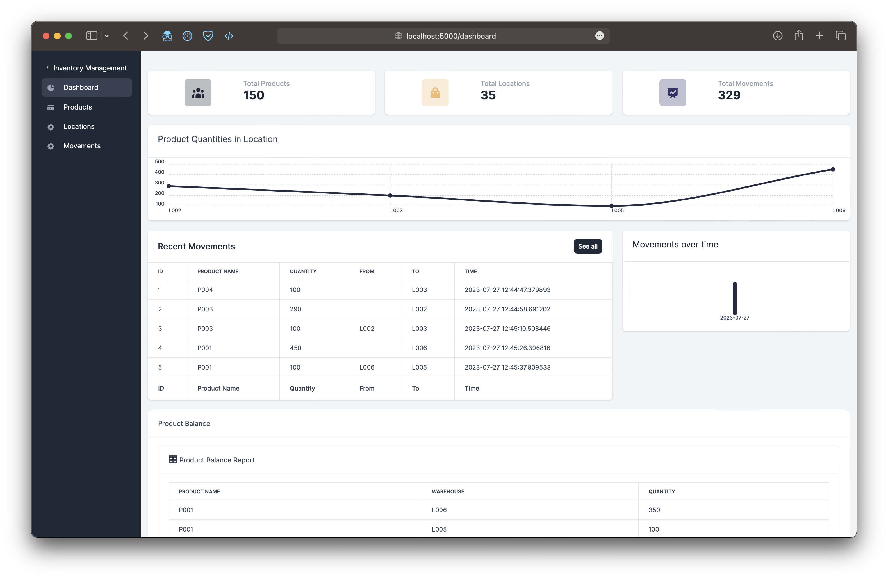
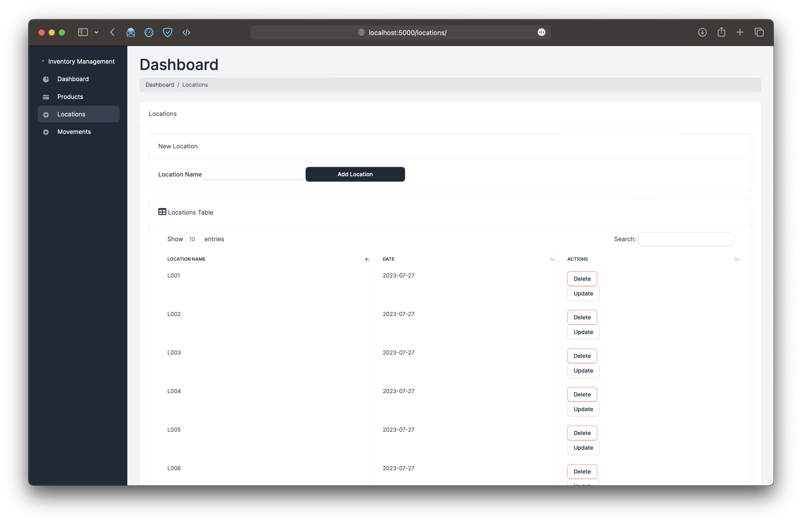
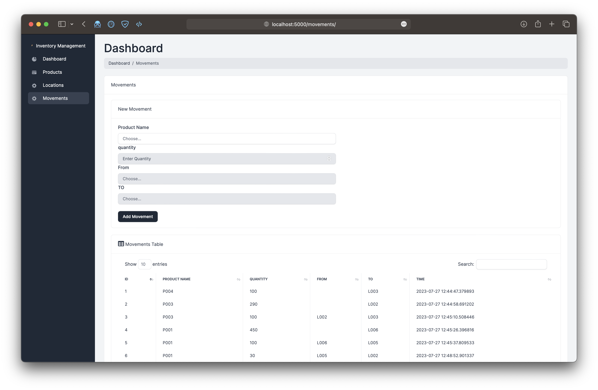

# Inventory-Management

## Setup

To run this application locally, follow the steps below:


1. Clone the repository:

   ```bash
   git clone https://github.com/linusaltacc/Inventory-Management.git
   cd Inventory-Management
   ```
   
2. Install Flask and other dependencies:

   ```bash
   pip install -r requirements.txt
   ```


5. Open your web browser and go to `http://localhost:5000/dashboard` to access the dashboard.

## Data Models

The application uses the following data models:

### Product

- `product_id`: The unique identifier for the product.
- `date_created`: The date when the product was created.

### Location

- `location_id`: The unique identifier for the location.
- `date_created`: The date when the location was created.

### ProductMovement

- `movement_id`: The unique identifier for the movement.
- `product_id`: Foreign key reference to the `Product` model.
- `qty`: The quantity of products moved.
- `from_location`: Foreign key reference to the `Location` model, representing the source location of the movement.
- `to_location`: Foreign key reference to the `Location` model, representing the destination location of the movement.
- `movement_time`: The timestamp when the movement occurred.

## Features

- View the total number of products, locations, and movements in the dashboard.
- Visualize product movements using a line chart, which shows the quantity of products moved to each location over time.
- View a bar chart that represents different metrics related to product movements.

## Screenshots

### Dashboard



### Locations Page



### Products Page


### Movements Page



## Usage

The application provides the following routes:

- `/dashboard`: Displays the dashboard with various charts and metrics.
- `/locations/`: Lists all locations and allows adding new locations.
- `/products/`: Lists all products and allows adding new products.
- `/movements/`: Lists all product movements and allows adding new movements.
- `/update-product/<name>`: Allows updating an existing product.
- `/delete-product/<name>`: Deletes an existing product.
- `/update-location/<name>`: Allows updating an existing location.
- `/delete-location/<name>`: Deletes an existing location.
- `/update-movement/<int:id>`: Allows updating an existing movement.
- `/delete-movement/<int:id>`: Deletes an existing movement.
